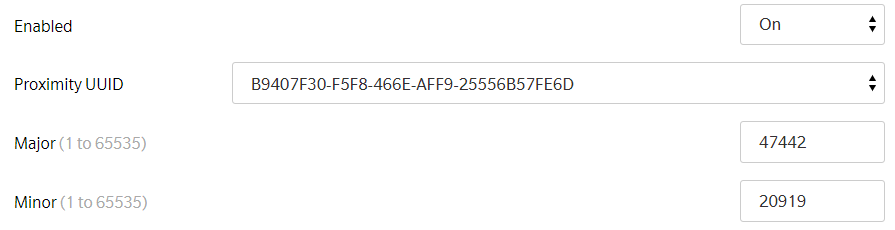
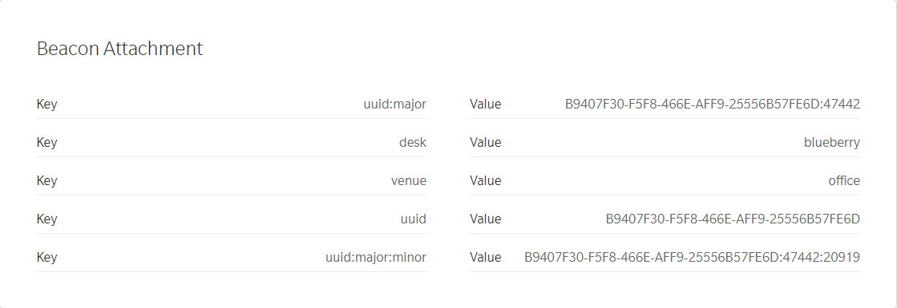

# Migration script for attachments in tags and from iBeacon

Script parses content of tags and converts encoded in them attachments 
(used in version `alpha` of Proximity SDK) to Attachments in separate section 
of Estimote Cloud. 

Additionally to ease migration from iBeacon it is able to also add attachments
from iBeacon parameters (Major, Minor Proximity UUID)

## Usage

To use it you need to have an account in Estimote Cloud and [create an app](https://cloud.estimote.com/#/apps/add) to obtain
`APP_ID` and `APP_TOKEN`

Install required python packages:

`pip install -r requirements.txt`

Run script:

`python migration.py YOUR_APP_ID YOUR_APP_TOKEN`

If you're migrating from an older Proximity SDK (and not Estimote SDK or Core Location), you can add --no-ibeacon to skip migrating UUID/major/minor to attachments

## Example

For beacon with tag:

`{"attachment":{"desk":"blueberry","venue":"office"}}`

And with enabled iBeacon:

After running script following attachments will be present:

